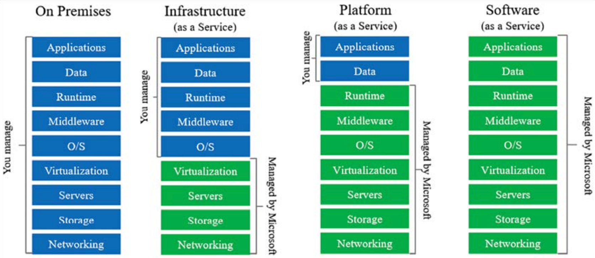

# Deciding on the Best Cloud-Based Solution
- This chapter focuses on designing cloud-based applications and understanding various software architecture models. It explores the opportunities provided by the cloud and discusses different types of cloud services, including Infrastructure as a Service (IaaS), Platform as a Service (PaaS), Software as a Service (SaaS), and Serverless solutions. The chapter also covers the use of hybrid solutions and their benefits. The choice between these options depends on the specific project scenario, which will be further discussed in the chapter.

## Different software deployment models
- Cloud solutions can be deployed using different models depending on the type of team and organization. Companies with infrastructure engineers typically opt for Infrastructure as a Service (IaaS) where they have more control over the infrastructure. On the other hand, companies whose core business is not IT often prefer Software as a Service (SaaS) solutions. Developers may choose Platform as a Service (PaaS) or serverless options when they don't need to manage the infrastructure. As a software architect, it is important to optimize cost and work factors throughout the development and maintenance of the solution. It is crucial to understand the system's needs and connect them with peripheral solutions to accelerate delivery and meet customer specifications.

### IaaS and Azure opportunities
- Infrastructure as a Service (IaaS) is a cloud service model where the computing infrastructure, including servers, storage, and firewalls, is provided and managed by a cloud provider. In Azure, there are various IaaS services available, such as virtual machines, network components, and storage options. As a software architect, it is important to understand these services and choose the ones that best fit the project requirements. Azure allows you to easily create and configure virtual machines, offering a wide range of hardware options with high computing power and scalability. The cloud's agility and quick time-to-market make it an excellent choice for temporary workloads or new business ideas that require significant computing resources. Cloud computing provides capabilities that may not be readily available in on-premises data centers, allowing for efficient resource utilization and cost optimization.

#### Security responsibility in IaaS
- When using an Infrastructure as a Service (IaaS) platform, it's important to understand that the responsibility for security is shared between the cloud provider and the user. Contrary to popular belief, the cloud provider does not handle all aspects of security. The user is still responsible for securing the operating system and the application layers. This means that you need to implement security measures and best practices to protect your system, which can increase the overall cost.

- IaaS is a suitable choice if you want to migrate an existing on-premises infrastructure to the cloud while maintaining scalability. Azure offers tools and services that facilitate this transition. However, if you're starting a new application development project, it's advisable to consider other options available in Azure beyond IaaS.

### PaaS - a world of opportunities for developers
- Platform as a Service (PaaS) offers developers a world of opportunities by providing a high-speed environment for software development. With PaaS, developers can focus on their data and applications while leaving security configurations to the platform. This allows for faster delivery of richer solutions, and the time-to-market can justify the cost of using PaaS.
- While PaaS provides advantages, it's important to note that you may have limited control over the operating system and may not be able to connect to it in certain situations. 
- Some common PaaS components in Microsoft Azure are Azure Web Apps, Azure SQL Server, and Azure Cognitive Services. These components demonstrate the power and versatility of development in the PaaS world.

#### Web apps
- A web app is a Platform as a Service (PaaS) option that allows you to deploy various types of applications, including .NET, .NET Core, Java, PHP, Node.js, and Python. This option eliminates the need for setting up a structure or an IIS web server.
- Web apps offer a plan option where you don't need to pay for usage, although there are some limitations, such as only supporting 32-bit apps and lacking scalability features. Despite these limitations, web apps can be a great choice for prototyping and testing purposes.

#### SQL Databases
- SQL databases in Azure provide the power of Microsoft SQL Server for storage and data processing without the need for a dedicated server. Azure takes care of database backups, allowing you to focus on your core business needs and achieve a fast time-to-market.
- Creating a SQL database in Azure is straightforward, but attention should be paid to server creation and pricing. The database depends on a SQL server, which provides the necessary parameters for accessing the database using tools like Visual Studio and SQL Server Management Studio. Security features such as Transparent Data Encryption and IP firewalls are available.
- Choosing the appropriate pricing tier is important as there are different options to optimize costs based on your specific scenario. Once the configuration is complete, connecting to the server database is similar to on-premises SQL servers, with the Azure SQL Server firewall providing additional security.

#### Azure Cognitive Services
- Azure Cognitive Services is a valuable resource for incorporating Artificial Intelligence (AI) into software architecture. It emphasizes the convenience of leveraging pre-existing AI services instead of developing AI solutions from scratch. Azure Cognitive Services offers a range of APIs for vision, knowledge, speech, search, and language applications, some of which require training. The advantage of using PaaS, in this case, is that it eliminates the need for extensive preparation and allows software architects to focus on solving business problems rather than infrastructure management.

[Example Cognitive service](cognitive-service)